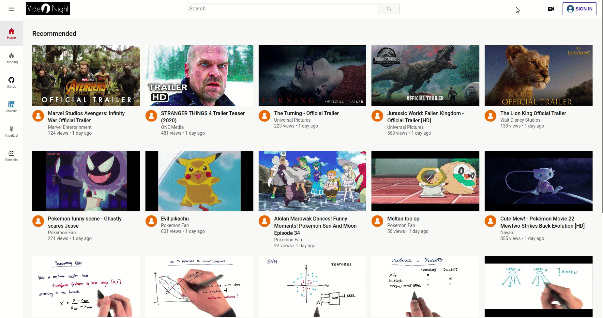

# VideoNight

## Introduction

VideoNight is a video-sharing platform inspired by Youtube that allows users to view and upload videos. Users can create an account (or login as demo user) to like and comment on other people's videos as well as upload and edit their own videos on their profile page. The site also features a trending page and a search bar to search for specific videos.

[Heroku Link](https://videonight.herokuapp.com/#/) 

## Technologies used

* Backend
  * PostgreSQL
  * Ruby on Rails
* Frontend
  * React
  * Redux
* Cloud platforms
  * Amazon Web Services (S3)
  * Heroku

## Functionality and MVPs

* Users are able to signup, login, or logout
* Users can use a demo login to try the site
* Logged in users can upload, edit and delete their own videos 
* Users can like/dislike and comment on videos as well as like/dislike comments
* Users can see trending videos and use the search bar to search for specific videos

## Features

### Login and Logout

### Upload and delete video

### Like and Comment

### Search and trending page

